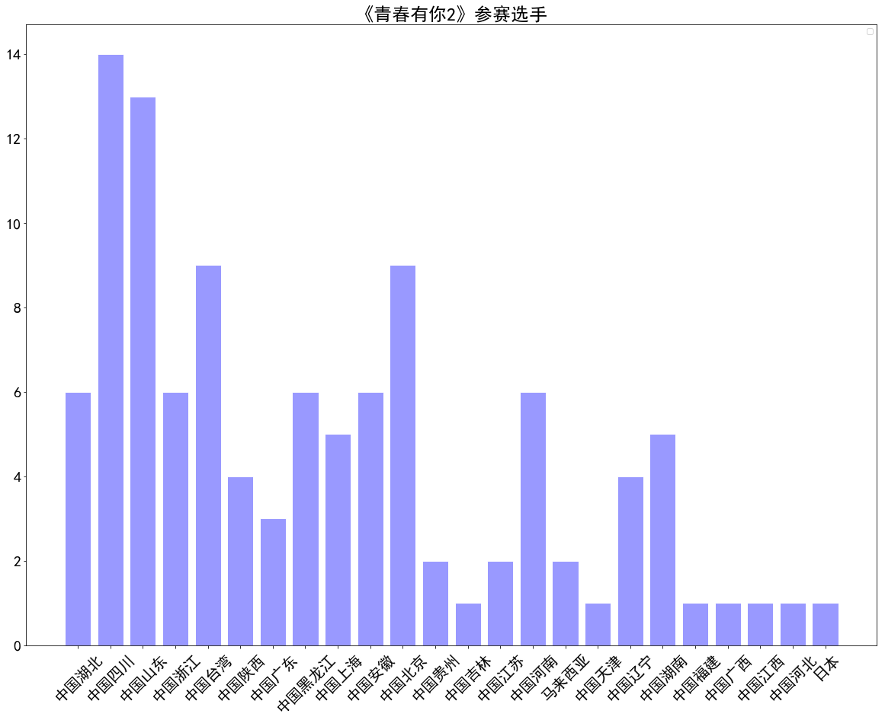
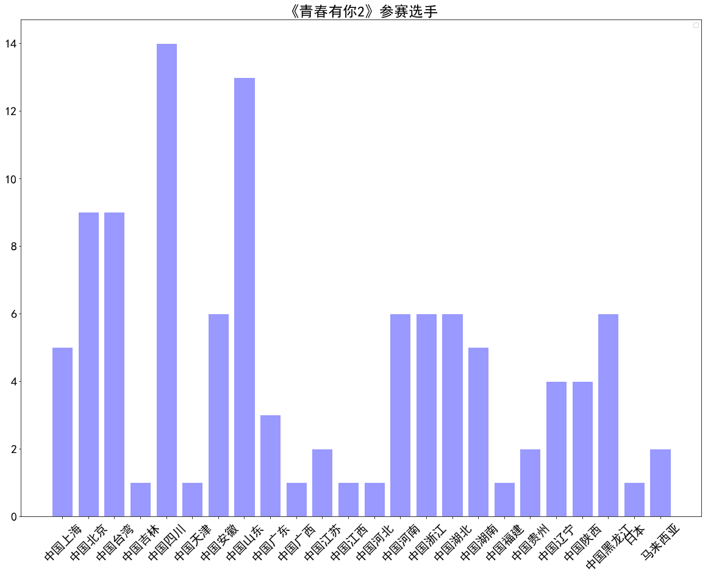
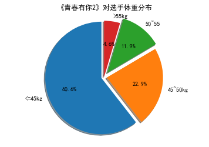

## ！！！作业说明！！！

## 请在下方提示位置，补充代码，对《青春有你2》对选手体重分布进行可视化，绘制饼状图，如下图所示：


## 任务描述：

基于第二天实践使用Python来爬去百度百科中《青春有你2》所有参赛选手的信息，进行数据可视化分析。


```python
# 如果需要进行持久化安装, 需要使用持久化路径, 如下方代码示例:
# !mkdir /home/aistudio/external-libraries
# !pip install matplotlib -t /home/aistudio/external-libraries
```

    Looking in indexes: https://pypi.mirrors.ustc.edu.cn/simple/
    Collecting matplotlib
    [?25l  Downloading https://mirrors.tuna.tsinghua.edu.cn/pypi/web/packages/b2/c2/71fcf957710f3ba1f09088b35776a799ba7dd95f7c2b195ec800933b276b/matplotlib-3.2.1-cp37-cp37m-manylinux1_x86_64.whl (12.4MB)
         |████████████████████████████████| 12.4MB 465kB/s eta 0:00:01
    [?25hCollecting python-dateutil>=2.1 (from matplotlib)
      WARNING: Retrying (Retry(total=4, connect=None, read=None, redirect=None, status=None)) after connection broken by 'ReadTimeoutError("HTTPSConnectionPool(host='mirrors.ustc.edu.cn', port=443): Read timed out. (read timeout=15)")': /pypi/web/simple/python-dateutil/
    [?25l  Downloading https://mirrors.tuna.tsinghua.edu.cn/pypi/web/packages/d4/70/d60450c3dd48ef87586924207ae8907090de0b306af2bce5d134d78615cb/python_dateutil-2.8.1-py2.py3-none-any.whl (227kB)
         |████████████████████████████████| 235kB 57.6MB/s eta 0:00:01
    [?25hCollecting cycler>=0.10 (from matplotlib)
      Downloading https://mirrors.tuna.tsinghua.edu.cn/pypi/web/packages/f7/d2/e07d3ebb2bd7af696440ce7e754c59dd546ffe1bbe732c8ab68b9c834e61/cycler-0.10.0-py2.py3-none-any.whl
    Collecting numpy>=1.11 (from matplotlib)
    [?25l  Downloading https://mirrors.tuna.tsinghua.edu.cn/pypi/web/packages/e7/38/f14d6706ae4fa327bdb023ef40b4d902bccd314d886fac4031687a8acc74/numpy-1.18.3-cp37-cp37m-manylinux1_x86_64.whl (20.2MB)
         |████████████████████████████████| 20.2MB 467kB/s eta 0:00:01     |██████████████████████████▍     | 16.6MB 122kB/s eta 0:00:29
    [?25hCollecting pyparsing!=2.0.4,!=2.1.2,!=2.1.6,>=2.0.1 (from matplotlib)
    [?25l  Downloading https://mirrors.tuna.tsinghua.edu.cn/pypi/web/packages/8a/bb/488841f56197b13700afd5658fc279a2025a39e22449b7cf29864669b15d/pyparsing-2.4.7-py2.py3-none-any.whl (67kB)
         |████████████████████████████████| 71kB 21.1MB/s eta 0:00:01
    [?25hCollecting kiwisolver>=1.0.1 (from matplotlib)
    [?25l  Downloading https://mirrors.tuna.tsinghua.edu.cn/pypi/web/packages/31/b9/6202dcae729998a0ade30e80ac00f616542ef445b088ec970d407dfd41c0/kiwisolver-1.2.0-cp37-cp37m-manylinux1_x86_64.whl (88kB)
         |████████████████████████████████| 92kB 15.8MB/s eta 0:00:01
    [?25hCollecting six>=1.5 (from python-dateutil>=2.1->matplotlib)
      Downloading https://mirrors.tuna.tsinghua.edu.cn/pypi/web/packages/65/eb/1f97cb97bfc2390a276969c6fae16075da282f5058082d4cb10c6c5c1dba/six-1.14.0-py2.py3-none-any.whl
    Installing collected packages: six, python-dateutil, cycler, numpy, pyparsing, kiwisolver, matplotlib
    Successfully installed cycler-0.10.0 kiwisolver-1.2.0 matplotlib-3.2.1 numpy-1.18.3 pyparsing-2.4.7 python-dateutil-2.8.1 six-1.14.0


```python
# 同时添加如下代码, 这样每次环境(kernel)启动的时候只要运行下方代码即可:
# Also add the following code, so that every time the environment (kernel) starts, just run the following code:
import sys
sys.path.append('/home/aistudio/external-libraries')
```


```python
# 下载中文字体
!wget https://mydueros.cdn.bcebos.com/font/simhei.ttf
# 将字体文件复制到matplotlib字体路径
!cp simhei.ttf /opt/conda/envs/python35-paddle120-env/lib/python3.7/site-packages/matplotlib/mpl-data/fonts/ttf/
# 一般只需要将字体文件复制到系统字体目录下即可，但是在aistudio上该路径没有写权限，所以此方法不能用
# !cp simhei.ttf /usr/share/fonts/

# 创建系统字体文件路径
!mkdir .fonts
# 复制文件到该路径
!cp simhei.ttf .fonts/
!rm -rf .cache/matplotlib
```

    --2020-04-25 15:14:14--  https://mydueros.cdn.bcebos.com/font/simhei.ttf
    Resolving mydueros.cdn.bcebos.com (mydueros.cdn.bcebos.com)... 182.61.200.195, 182.61.200.229
    Connecting to mydueros.cdn.bcebos.com (mydueros.cdn.bcebos.com)|182.61.200.195|:443... connected.
    HTTP request sent, awaiting response... 403 Forbidden
    2020-04-25 15:14:14 ERROR 403: Forbidden.


## 绘制选手区域分布柱状图


```python
import matplotlib.pyplot as plt
import numpy as np 
import json
import matplotlib.font_manager as font_manager

#显示matplotlib生成的图形
%matplotlib inline

with open('data/data31557/20200422.json', 'r', encoding='UTF-8') as file:
         json_array = json.loads(file.read())

#绘制小姐姐区域分布柱状图,x轴为地区，y轴为该区域的小姐姐数量

zones = []
for star in json_array:
    zone = star['zone']
    zones.append(zone)
print(len(zones))
print(zones)


zone_list = []
count_list = []

for zone in zones:
    if zone not in zone_list:
        count = zones.count(zone)
        zone_list.append(zone)
        count_list.append(count)

print(zone_list)
print(count_list)

# 设置显示中文
plt.rcParams['font.sans-serif'] = ['SimHei'] # 指定默认字体

plt.figure(figsize=(20,15))

plt.bar(range(len(count_list)), count_list,color='r',tick_label=zone_list,facecolor='#9999ff',edgecolor='white')

# 这里是调节横坐标的倾斜度，rotation是度数，以及设置刻度字体大小
plt.xticks(rotation=45,fontsize=20)
plt.yticks(fontsize=20)

plt.legend()
plt.title('''《青春有你2》参赛选手''',fontsize = 24)
plt.savefig('/home/aistudio/work/result/bar_result.jpg')
plt.show()

```

    No handles with labels found to put in legend.


    109
    ['中国湖北', '中国四川', '中国山东', '中国浙江', '中国山东', '中国台湾', '中国陕西', '中国广东', '中国黑龙江', '中国上海', '中国四川', '中国山东', '中国安徽', '中国安徽', '中国安徽', '中国北京', '中国贵州', '中国吉林', '中国四川', '中国四川', '中国江苏', '中国山东', '中国山东', '中国山东', '中国山东', '中国江苏', '中国四川', '中国山东', '中国山东', '中国广东', '中国浙江', '中国河南', '中国安徽', '中国河南', '中国北京', '中国北京', '马来西亚', '中国湖北', '中国四川', '中国天津', '中国黑龙江', '中国四川', '中国陕西', '中国辽宁', '中国湖南', '中国上海', '中国贵州', '中国山东', '中国湖北', '中国黑龙江', '中国黑龙江', '中国上海', '中国浙江', '中国湖南', '中国台湾', '中国台湾', '中国台湾', '中国台湾', '中国山东', '中国北京', '中国北京', '中国浙江', '中国河南', '中国河南', '中国福建', '中国河南', '中国北京', '中国山东', '中国四川', '中国安徽', '中国河南', '中国四川', '中国湖北', '中国四川', '中国陕西', '中国湖南', '中国四川', '中国台湾', '中国湖北', '中国广西', '中国江西', '中国湖南', '中国湖北', '中国北京', '中国陕西', '中国上海', '中国四川', '中国山东', '中国辽宁', '中国辽宁', '中国台湾', '中国浙江', '中国北京', '中国黑龙江', '中国北京', '中国安徽', '中国河北', '马来西亚', '中国四川', '中国湖南', '中国台湾', '中国广东', '中国上海', '中国四川', '日本', '中国辽宁', '中国黑龙江', '中国浙江', '中国台湾']
    ['中国湖北', '中国四川', '中国山东', '中国浙江', '中国台湾', '中国陕西', '中国广东', '中国黑龙江', '中国上海', '中国安徽', '中国北京', '中国贵州', '中国吉林', '中国江苏', '中国河南', '马来西亚', '中国天津', '中国辽宁', '中国湖南', '中国福建', '中国广西', '中国江西', '中国河北', '日本']
    [6, 14, 13, 6, 9, 4, 3, 6, 5, 6, 9, 2, 1, 2, 6, 2, 1, 4, 5, 1, 1, 1, 1, 1]





```python
import matplotlib.pyplot as plt
import numpy as np 
import json
import matplotlib.font_manager as font_manager
import pandas as pd

#显示matplotlib生成的图形
%matplotlib inline


df = pd.read_json('data/data31557/20200422.json')
#print(df)

grouped=df['name'].groupby(df['zone'])
s = grouped.count()

zone_list = s.index
count_list = s.values


# 设置显示中文
plt.rcParams['font.sans-serif'] = ['SimHei'] # 指定默认字体

plt.figure(figsize=(20,15))

plt.bar(range(len(count_list)), count_list,color='r',tick_label=zone_list,facecolor='#9999ff',edgecolor='white')

# 这里是调节横坐标的倾斜度，rotation是度数，以及设置刻度字体大小
plt.xticks(rotation=45,fontsize=20)
plt.yticks(fontsize=20)

plt.legend()
plt.title('''《青春有你2》参赛选手''',fontsize = 24)
plt.savefig('/home/aistudio/work/result/bar_result02.jpg')
plt.show()
```

    No handles with labels found to put in legend.





## 请在下面完成作业，对选手体重分布进行可视化，绘制饼状图


```python
import matplotlib.pyplot as plt
import numpy as np
import json
import matplotlib.font_manager as font_manager
%matplotlib inline

df=pd.read_json('data/data31557/20200422.json')

weights=df['weight']
arrs=weights.values

for i in range(len(arrs)):
    arrs[i]=float(arrs[i][0:-2])

bin=[0,45,50,55,100]
se1=pd.cut(arrs,bin)

labels='<=45kg','45~50kg','50~55','>55kg'
sizes=pd.value_counts(se1)

print(sizes)
explode=(0.05,0.05,0.1,0)

fig1,ax1=plt.subplots()
ax1.pie(sizes,explode=explode,labels=labels,autopct='%1.1f%%',shadow=True,startangle=90)
ax1.axis('equal')
plt.title("《青春有你2》对选手体重分布")
plt.savefig('/home/aistudio/work/result/pie_result02.jpg')
plt.show()
```

    (45, 50]     66
    (0, 45]      25
    (50, 55]     13
    (55, 100]     5
    dtype: int64





```python

```
